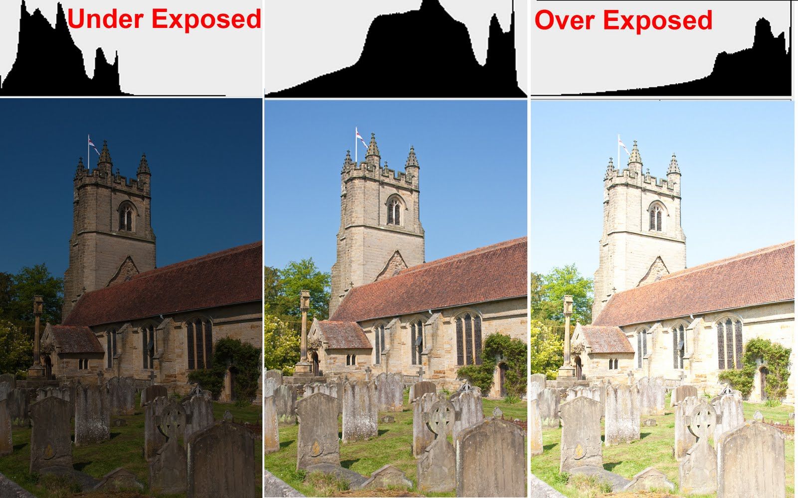
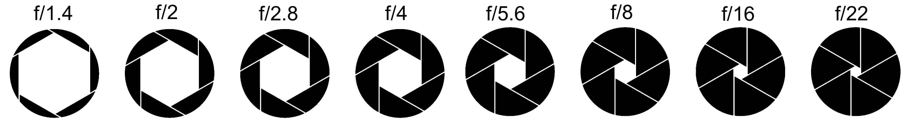

.. _bases:

*********
Les bases
*********

.. _cadrage:

Le cadrage
==========

L'horizon
---------

L'horizon doit toujours être droit.
Le mieux est d'utiliser une grille sur l'écran.

Les contours
------------

Il faut être attentif à ce qui se trouve dans les contours.
Mieux vaut éviter de mettre des éléments superflus dans les contours.
Par exemple, sur une photo de paysage, si il y a une branche morte qui apparaît
sur un bord, ça a peu d'intérêt.

Couper les sujets
-----------------

Soit les sujets doivent être représentés en entier,
soit ils doivent être coupés franchement.
Si on coupe un sujet, il ne faut pas le couper au niveau d'une articulation,
c'est-à-dire, pas au niveau des chevilles, poignets, genoux, coudes, cou.
A la place, il vaut mieux couper au niveau du buste, à mi-cuisse, mi-mollet,
avant-bras, etc.

.. _exposition:

L'exposition
============

L'histogramme
-------------

L'histogramme donne des informations sur l'exposition de l'image.
Pour avoir une exposition équilibrée, l'histogramme doit être balancé entre
pixels sombres et pixels clairs.
Ci-dessous, on voit que l'image de gauche est sous-exposée et
que son histogramme penche plus vers la gauche.
L'image de droite est sur-exposée, et son histogramme tend vers la droite.
Enfin, l'image du centre est correctement exposée, et son histograme est
bien balancé.

La correction d'exposition
--------------------------

Si la scène ne permet pas d'avoir une exposition correcte (sous- ou sur-
exposée), il est possible d'utiliser une correction d'exposition.
La molette de droite permet d'éclaircir la photo (+1, +2, etc.) ou
d'assombrir la photo (-1, -2, etc.).

Le triange d'exposition
-----------------------

3 autres paramètres permettent de régler l'exposition d'une image.

- L'ouverture:
  C'est la taille de la "porte" par laquelle la lumière parvient au capteur.
  Elle est caractérisée par un nombre "f/".
  Plus le "f/" est petit, plus l'ouverture est grande et plus la lumière
  atteidra le capteur.

- La vitesse d'obturation:
  C'est en réalité un temps, le durée pendant lequel la "porte" est ouverte.
  La vitesse est exprimée en fractions de secondes ("1/"), mais sur l'appareil
  photo, le "1/" n'apparaît pas. "1/125" sera indiqué comme "125".
  Plus le temps de pose est long, plus la lumière a le temps de passer et
  d'atteindre le capteur.

- La sensibilité ISO:
  C'est un facteur d'amplification de la lumière.
  Plus les ISO sont élevés, plus la photo sera claire.

Effet des réglages d'exposition
-------------------------------

Les paramètres du triangle n'ont pas seulement un effet sur l'exposition de
la photo, mais ils influent sur d'autres aspects également.

- L'ouverture vs la profondeur de champ (ou le bokeh):
  L'ouverture permet de faire varier la profondeur de champ et d'obtenir des
  "bokeh". Le bokeh est un effet de flou artistique, où le sujet est net et le
  reste de l'image est flou ce qui permet de bien mettre en avant le sujet.
  A petite ouverture ("f/" grand), toute l'image sera nette et il n'y aura pas
  de bokeh.
  A grande ouverture par contre ("f/" petit), la profondeur de champ diminue et
  le sujet mis au point sera net pendant que le reste de l'image sera flou.

- La vitesse d'obturation vs le flou de bougé:
  Si on photographie à main levée, il y a toujours des légers mouvements
  naturels du corps. Dans le cas où la vitesse d'obturation est trop lente (ou
  le temps de pose trop long), ces mouvements vont causer un flou sur la photo.
  Pour rémédier à ça, il faut diminuer le temps de pose (et augmenter
  l'exposition via un autre paramètre si besoin), ou utiliser un trépied pour
  supprimer ces mouvements. Certains objectifs ont aussi un stabilisateur qui
  permete de gagner quelques stops à main lévée.

- La sensibilité ISO vs le bruit numérique:
  Les ISO permettent d'amplifier artificiellement la lumière.
  Mais si on amplifie trop, cela transforme l'image en une brouille de pixels.
  Mieux vaut garder les ISO bas autant que possible.

Les modes d'exposition
----------------------

- Le mode P:
  Ces 3 paramètres sont en automatique et l'appareil photo règle lui-même
  comment géré l'ouverture, la vitesse d'obturation et la sensibilité ISO.
  Ce n'est pas un mode complètement automatique puisque l'appareil ne gère pas
  la mise au point par exemple. Néanmoins, il peut parfois être utile
  d'utiliser un mode semi-automatique.

- Le mode A (ou Av):
  C'est le mode "aperture" en anglais, ou priorité ouverture.
  On règle manuellement l'ouverture et l'appareil photo règle lui-même la
  vitesse et les ISO. C'est le mode à utiliser pour réaliser des bokeh.

- Le mode S (ou Tv):
  C'est le mode "speed" en anglais, ou priorité vitesse.
  On règle manuellement la vitesse d'obturation et l'appareil règle lui-même
  l'ouverture et les ISO. C'est le mode à utiliser pour des sujets qui bougent
  ou pour faire des poses longues.

Prendre une bonne photo
=======================

La mise au point
----------------

Pour que le sujet d'intérêt soit net, il faut faire la mise au point sur ce
sujet. Pour ce faire, il faut utiliser le joystick pour placer le sujet dans le
collimateur (petit carré).

Le mode rafale
--------------

Sur la position "S", l'appareil photo ne fait qu'une seule photo.
Si le sujet bouge, ça ne fait qu'une chance pour avoir une bonne photo.
En mode rafale, l'appareil photo va prendre plusieurs photos en un court
instant, ce qui multiplie les chances d'avoir une photo net.
En plus de la netteté, ça multiple les chances de capter le meilleur instant.
De toute façon, il est possible de faire une seule photo en mode rafale en
appuyant très brièvement sur le déclencheur.